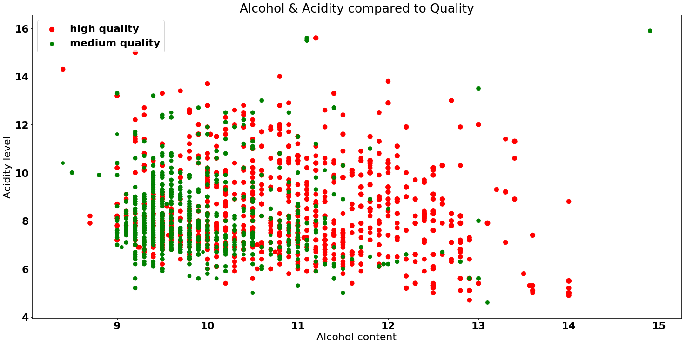
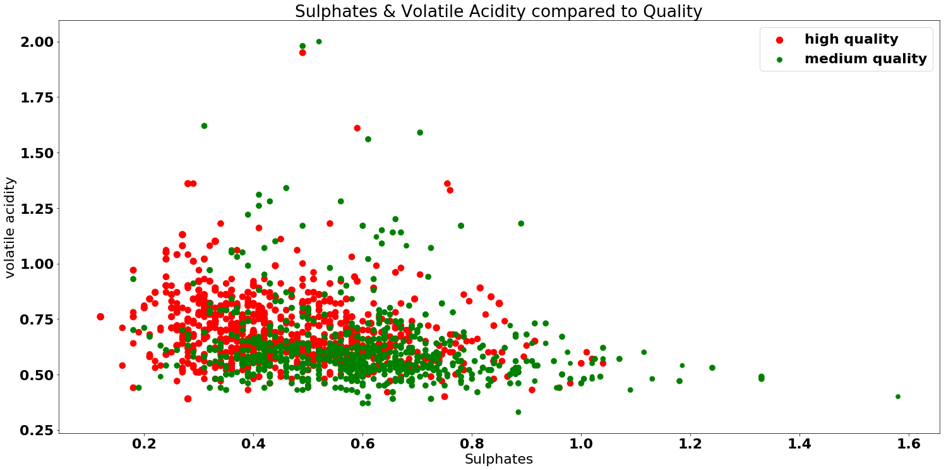
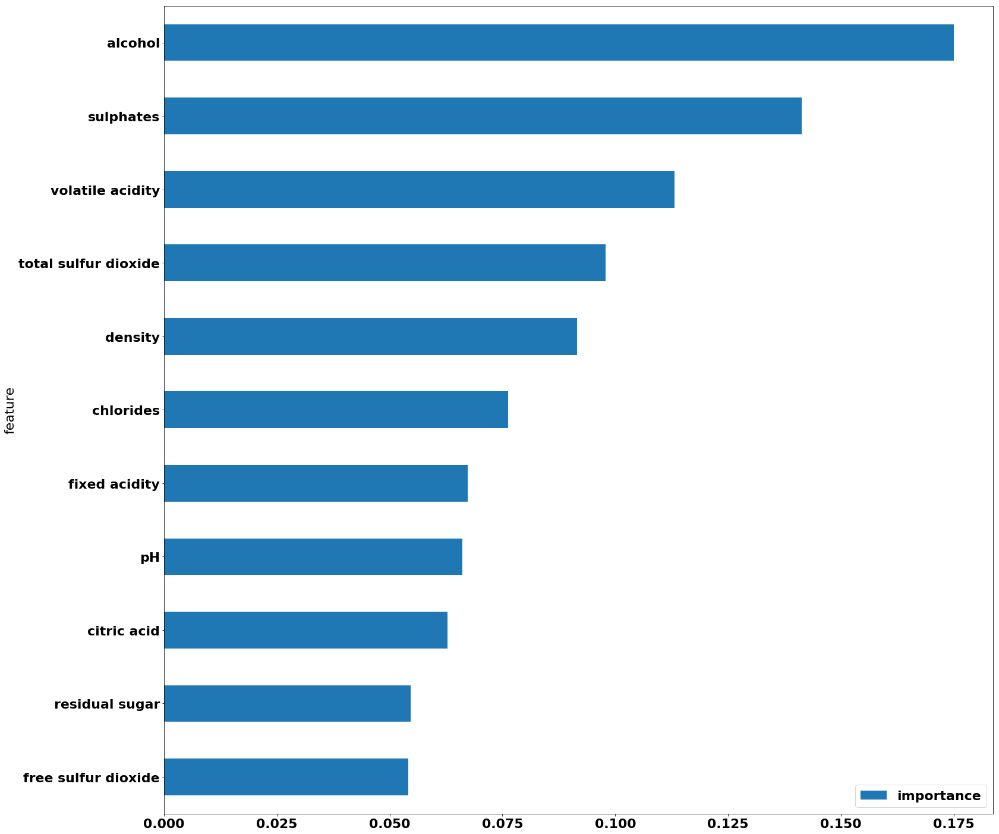

# Machine Learning - In "Vinho Verde" Veritas

Until now, wine connoisseurs have had to rely almost exclusively on sensory characteristics to evaluate the quality of wines. Our group used Machine Learning to make similar predictions based on the wines’ physio-chemical properties.

Steps:

- Setup Environment, Import Libraries and Modules, Load Data
- Split Data into Training and Test Sets
- Run Preliminary Models
- Create Visualizations with MatplotLib and Seaborn
- Tune Model and Declare Hyperpermaters
- Refit, Evaluate, and Save Model

Results:

- Alcohol Content proved to be the feature with the highest importance
- Gradient Boosting Classifier had the highest accuracy score
- Alogrithm optimization inccreased accuracy score from 0.7864 to 0.8125 (3%).

